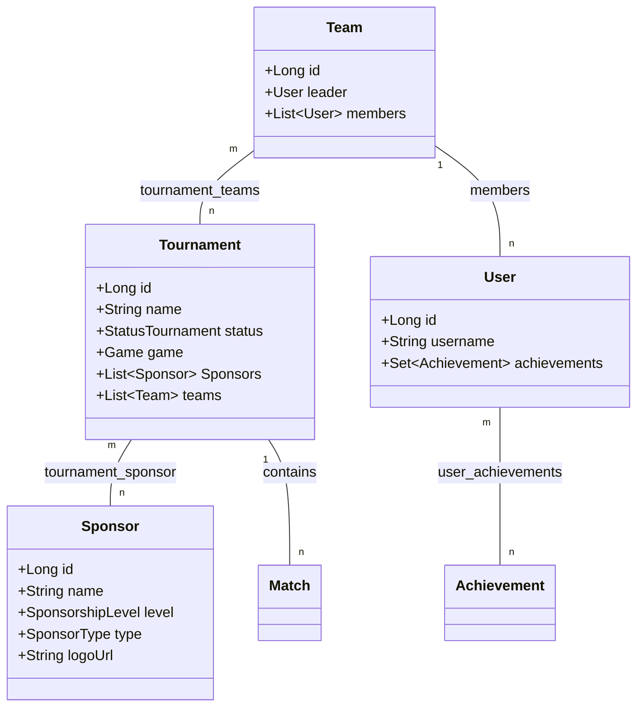
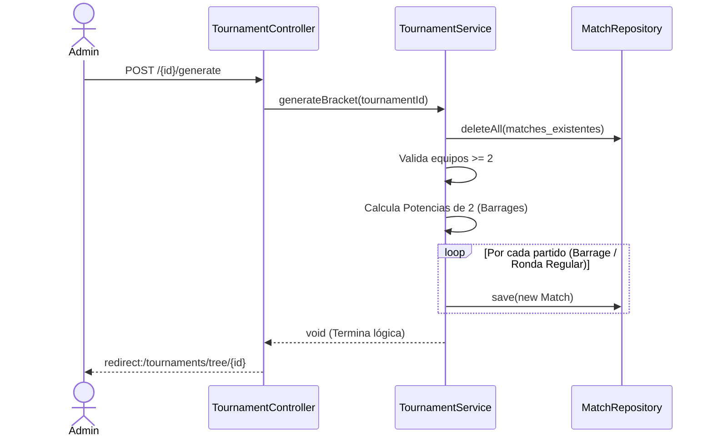

## Validación UI/UX (Fase 2)
Se realizó una sesión de validación de prototipos con usuarios del perfil "Jugador/Líder de Equipo".
* **Hallazgo 1:** Los usuarios no sabían dónde ver sus logros.
* **Acción Tomada:** Se priorizó mover la visualización de iconos (🥇, 👑) directamente al perfil principal del usuario (`/profile`).
* **Hallazgo 2:** El árbol de torneos (Bracket) se veía amontonado en móviles.
* **Acción Tomada:** Se agregó CSS responsivo (`overflow-x: auto`) a la vista de los brackets para permitir scroll horizontal.