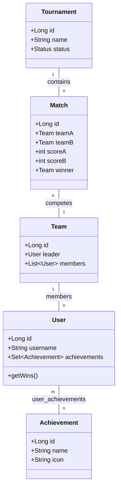

```mermaid
classDiagram
class User {
+Long id
+String username
+Set~Achievement~ achievements
+getWins()
}
class Achievement {
+Long id
+String name
+String icon
}
class Team {
+Long id
+User leader
+List~User~ members
}
class Match {
+Long id
+Team teamA
+Team teamB
+int scoreA
+int scoreB
+Team winner
}
class Tournament {
+Long id
+String name
+Status status
}

    User "m" -- "n" Achievement : user_achievements
    Team "1" -- "n" User : members
    Tournament "1" -- "n" Match : contains
    Match "n" -- "1" Team : competes
```